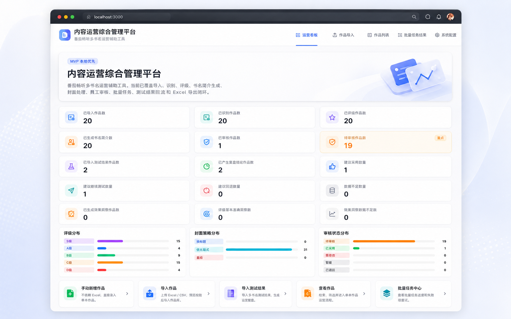
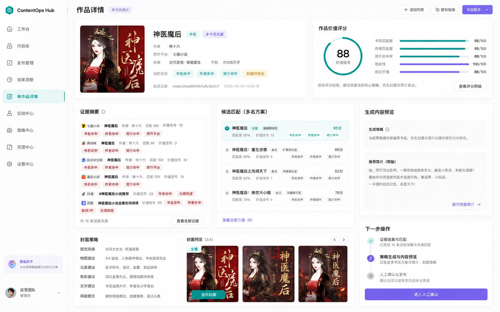
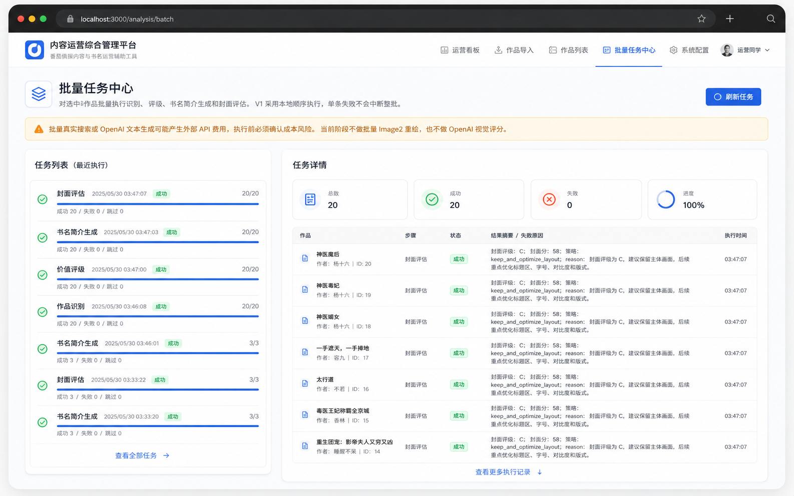
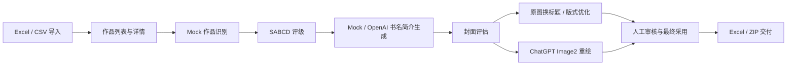
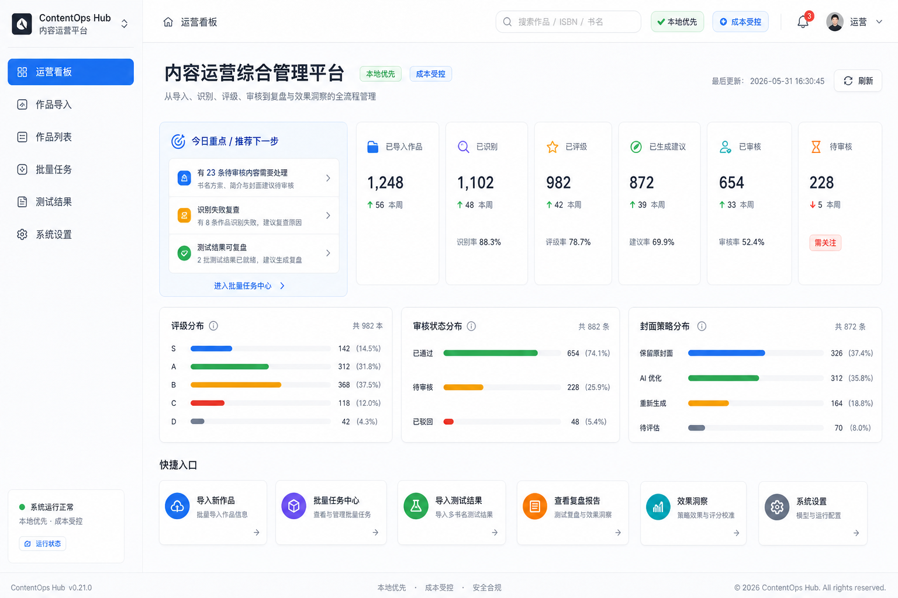

<div align="center">
  

  <h1>内容运营综合管理平台</h1>

  <p><strong>番茄畅畅听多书名运营辅助工具</strong></p>

  <p>
    面向有声书运营团队的本地优先 MVP：从作品导入、识别、评级、书名简介生成、封面评估、封面处理、人工审核到 Excel / ZIP 交付，沉淀一套可落地的内容运营工作流。
  </p>

  <p>
    
    
    
    
    
    
  </p>
</div>

---

## 项目概览

本项目服务于不懂代码的有声书运营人员，帮助运营团队批量处理作品资料，并快速判断：

- 哪些作品适合做多书名测试
- 哪些作品不建议轻易改名
- 哪些作品需要重新提炼卖点
- 当前封面应该保留、换标题、优化版式，还是后续重绘
- 最终采用哪一个书名、简介和封面
- 如何把运营建议导出成可交付 Excel / ZIP

系统默认优先使用 Mock / 本地规则跑通 MVP。OpenAI 文本生成和 ChatGPT Image2 封面重绘均为用户手动触发，不默认批量调用。

## Interface Preview

> Preview images are design references generated for the UI redesign direction. They are not production screenshots.

<div align="center">
  
  <p><em>运营看板：从导入、识别、评级、审核到复盘与效果洞察的整体进度视图。</em></p>
</div>

<table>
  <tr>
    <td width="50%">
      
      <p align="center"><strong>单作品运营详情</strong></p>
      <p align="center">聚合搜索证据、价值评级、书名方案、简介生成、封面策略与下一步操作。</p>
    </td>
    <td width="50%">
      
      <p align="center"><strong>批量任务中心</strong></p>
      <p align="center">支持批量识别、评级、书名简介生成和封面评估，单条失败不影响整体。</p>
    </td>
  </tr>
</table>

## 已完成能力

| 模块 | 状态 | 说明 |
| --- | --- | --- |
| Excel / CSV 导入 | 已完成 | 支持预览、校验、重复检测、入库 |
| 手动新增作品 | 已完成 | 支持单本录入、业务作品 ID、远程封面 URL 和本地封面上传 |
| 作品列表与详情 | 已完成 | 支持搜索、品类筛选、审核状态筛选、评级筛选、分页 |
| Mock 作品识别 | 已完成 | 候选作品、匹配分数、风险提示、人工确认 |
| SABCD 价值评级 | 已完成 | OpenAI 正式评级、历史记录、人工采用、补充证据与多书名运营建议 |
| 书名 / 简介生成 | 已完成 | Mock 与 OpenAI provider 可切换 |
| 封面资产 | 已完成 | 支持本地上传和导入远程封面 URL |
| 封面评估 | 已完成 | 评分、评级、处理策略、人工确认 |
| 原图换标题 | 已完成 | 基于原封面生成 1:1 / 3:4 新版标题封面 |
| ChatGPT Image2 重绘 | 已完成 | 仅对单本作品手动确认成本后触发 |
| 人工审核与最终采用 | 已完成 | 保存最终书名、最终简介、最终封面和审核备注 |
| Excel 导出 | 已完成 | 支持单本、全部、当前筛选和勾选导出 |
| ZIP 交付包 | 已完成 | 包含 Excel 和已有最终封面文件 |
| 工作流提示 | 已完成 | 未识别、低置信度识别、人工确认识别对应不同评级提示 |
| 真实搜索适配层 | 进行中 | 默认 Mock，可配置 real/custom 搜索 provider，保存识别证据 |

## 技术路线



## 后续计划

- 使用阶段 20 验收清单完成完整交付测试
- 根据验收报告优先修复阻断问题
- 明确正式搜索供应商后补充 provider 契约测试和限流策略
- 图片生成保持默认关闭，避免 API 成本失控
- 详细路线图见 [`docs/roadmap.md`](docs/roadmap.md)

## 本地运行

```bash
npm install
npm run db:push
npm run dev
```

常用检查：

```bash
npm run typecheck
npm run lint
npm run build
npm run db:test
```

## 环境变量

请参考 `.env.example`。不要提交 `.env` 或 `.env.local`。

- `DATABASE_URL`：本地 SQLite 数据库
- `OPENAI_API_KEY`：仅服务端读取，不展示到前端
- `OPENAI_TEXT_MODEL`：文本生成模型
- `OPENAI_IMAGE_MODEL`：图片生成模型
- `OPENAI_PROXY_URL`：可选代理，支持 http / socks5 / socks5h
- `SEARCH_PROVIDER`：搜索 provider，默认 `mock`
- `SEARCH_API_KEY`：真实搜索 API key，仅服务端读取
- `SEARCH_BASE_URL`：真实搜索 API 地址
- `SEARCH_TIMEOUT_MS` / `SEARCH_MAX_RESULTS`：单本识别搜索超时和结果数量

## 安全策略

- 不把 API key 写入代码
- 不提交本地数据库、上传图片、`.env`、`.env.local`
- OpenAI 仅用户主动选择时调用
- 真实搜索仅用户主动选择并确认成本风险时触发，默认仍为 mock
- 图片生成不做默认批量任务
- 所有外部服务都保留 Mock 或本地 fallback
## 阶段 17：批量任务中心 V1

当前版本新增批量任务中心，支持在作品列表勾选作品后批量执行作品识别、作品价值评级、书名简介生成和封面评估。批量任务采用本地顺序执行，单条失败不影响整批，并支持在 `/analysis` 查看进度和重试失败项。

批量真实搜索或 OpenAI 文本生成需要用户确认成本风险；系统默认不批量调用 Image2，不做 OpenAI 视觉评分，也不引入 Redis / BullMQ 等后台队列。

## 阶段 18：多书名测试结果回流

当前版本新增测试结果回流与运营复盘能力。运营人员可以手动导入对照组和实验组数据，系统会按本地规则计算 CTR、转化率、完播率和收入变化，生成复盘结论，并在人工确认后将胜出版本设为最终采用结果。

阶段 18 不接平台后台自动抓数，不自动覆盖最终采用结果，不做复杂统计学显著性检验。

## 阶段 17.2：上传文件填写规则与导入校验增强

作品导入页已增加可见的填写规则、官方模板下载、兼容表头说明、单行校验提示和导入结果摘要。作品清单导入与多书名测试结果导入使用独立入口和独立模板，避免运营人员混用文件。

## 阶段 18.1：多书名测试结果导入填写规则

测试结果导入页已增加独立填写规则、兼容表头说明、官方模板下载、预览校验和导入结果摘要。测试结果导入与作品基础信息导入继续使用不同入口和不同模板。

## 阶段 19：运营效果回流与评分校准

阶段 19 在多书名测试复盘基础上增加本地规则洞察。系统会保存实验前评级、改名建议和封面策略快照，并根据真实测试结果判断评级是否偏高或偏低、书名与封面策略是否有效。数据不足时只生成风险提示，不会强行得出成功结论，也不会自动覆盖最终采用结果。

## 阶段 19.1：项目体验评估与界面清理

阶段 19.1 优化了运营看板、作品详情摘要、页内导航、作品列表密度、批量任务展示、导入检查清单和设置页运营视图。Excel 导出在保留原有总表的同时，新增运营总览、识别与评级详情、书名简介方案、封面处理、测试复盘、效果回流 6 个分类工作表，便于运营人员快速查看和交付。

## 阶段 19.2：批量进度与搜索 provider 流程

批量任务创建后会弹出轮询式进度窗口。单本和批量识别都支持显式选择 Mock 或 configured search；批量书名简介生成会保存实际 provider，避免用户误判是否调用外部 API。

## 阶段 20：交付验收与稳定性加固

项目已进入完整交付验收。新增验收清单、验收报告模板、脱敏样例数据指南、已知问题和路线图，并补充设置页轻量健康状态、用户可读错误兜底和 Excel 长文本换行。阶段 20 不增加大型业务功能。

## 阶段 21：UI 设计系统与产品体验重构

阶段 21 使用 Image2 高保真 UI 概念稿驱动后台体验重构。系统新增固定侧栏、紧凑顶栏、统一卡片和状态色、中文状态映射、运营工作台、单作品运营控制台、批量任务控制台和更明确的导入工作流。设计说明见 [`docs/ui-redesign.md`](docs/ui-redesign.md)。

<div align="center">
  
  <p><em>阶段 21 Image2 概念稿：统一侧栏、运营工作台、推荐下一步和紧凑数据分布。</em></p>
</div>
