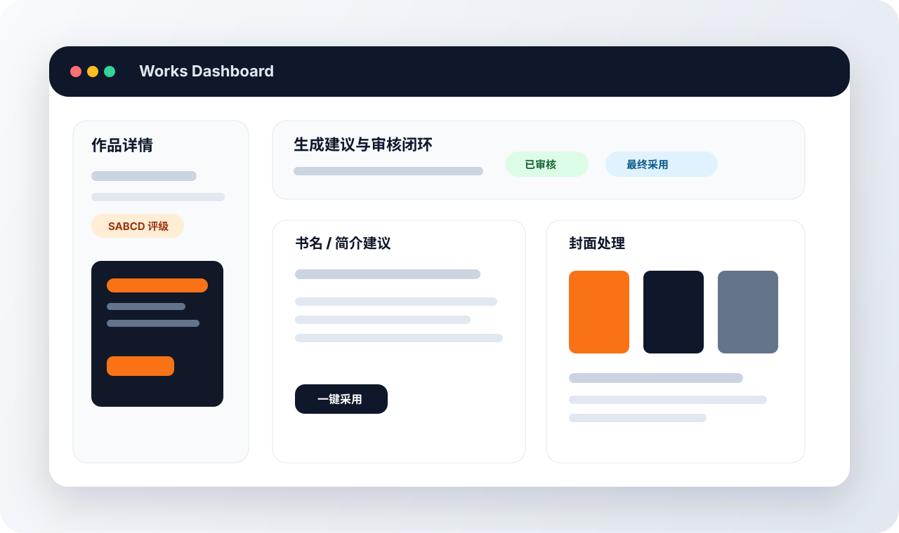
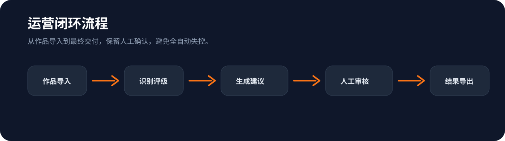
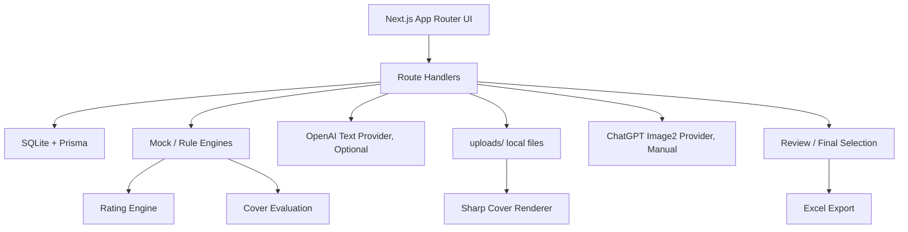
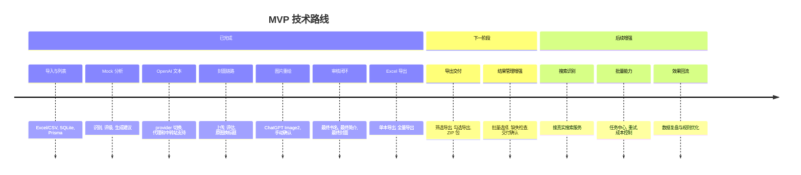

<div align="center">
  

  <h1>番茄畅畅听多书名运营辅助工具</h1>

  <p>
    面向有声书运营人员的本地化 MVP 工具：从作品导入、识别、评级、书名简介生成、封面评估、封面处理、人工审核到 Excel 导出，形成一套可落地的多书名运营工作流。
  </p>

  <p>
    
    
    
    
    
    
  </p>
</div>

---

## 项目概览

本项目服务于“不懂代码的有声书运营人员”，帮助运营团队批量处理作品资料，并快速判断：

- 哪些作品适合做多书名测试
- 哪些作品不建议轻易改名
- 哪些作品需要重新提炼卖点
- 当前封面应该保留、优化版式，还是后续重绘
- 最终采用哪个书名、简介和封面
- 如何把运营建议导出成可交付 Excel

系统默认优先使用 **Mock / 本地规则** 跑通 MVP，OpenAI 能力以可选 provider 方式接入，避免默认消耗 API 成本。

## 界面预览

> 下图为 README 展示用的产品示意图。真实页面以本地运行结果为准。



## 适用场景

| 场景 | 运营问题 | 工具能力 |
| --- | --- | --- |
| 批量作品初筛 | 哪些作品值得做多书名测试 | 导入 Excel / CSV 后进行识别、评级和运营建议生成 |
| 老品收入提升 | 老作品标题、简介、封面是否还有优化空间 | 生成新书名、新简介、封面 prompt，并支持人工确认 |
| 封面策略判断 | 原封面该保留、换标题，还是重绘 | 封面评估、原图换标题、ChatGPT Image2 重绘 |
| 人工审核交付 | 生成建议很多，最终采用结果难管理 | 审核状态、最终书名、最终简介、最终封面、备注 |
| 运营结果沉淀 | 需要把结果交付给团队或 CP | 单本 / 全量 Excel 导出，后续规划 ZIP 交付包 |

## 已完成能力

| 模块 | 状态 | 说明 |
| --- | --- | --- |
| Excel / CSV 导入 | ✅ 已完成 | 支持预览、校验、重复检测、入库 |
| 作品列表与详情 | ✅ 已完成 | 支持搜索、筛选、分页、详情查看 |
| Mock 作品识别 | ✅ 已完成 | 候选作品、匹配分数、风险提示、人工确认 |
| SABCD 价值评级 | ✅ 已完成 | 规则引擎评级，多书名运营建议 |
| 书名 / 简介生成 | ✅ 已完成 | Mock 与 OpenAI provider 可切换 |
| OpenAI 兼容中转站 | ✅ 已完成 | 支持 `OPENAI_BASE_URL` 与 `chat_completions` 兼容模式 |
| 封面资产 | ✅ 已完成 | 支持本地上传与导入远程封面 URL |
| 封面评估 | ✅ 已完成 | 输出评分、评级、处理策略、人工确认 |
| 原图换标题 | ✅ 已完成 | 基于原封面生成 1:1 / 3:4 新版标题封面 |
| ChatGPT Image2 重绘 | ✅ 已完成 | 针对 `redraw_cover` 策略，成本确认后手动生成 |
| 人工审核与最终采用 | ✅ 已完成 | 记录审核状态、最终书名、最终简介和最终封面 |
| Excel 导出 | ✅ 已完成 | 支持单本和全部作品导出 |

## 工作流




## 技术架构



## 技术栈

| 层级 | 技术 | 说明 |
| --- | --- | --- |
| Framework | Next.js App Router | 本地化 Web 工具主框架 |
| Language | TypeScript | 严格类型约束，降低后期维护成本 |
| UI | Tailwind CSS | 快速构建运营后台界面 |
| Database | SQLite | 本地 MVP 数据库，便于部署和迁移 |
| ORM | Prisma 6 | 数据模型、数据库同步和类型安全查询 |
| Excel | xlsx | 导入作品清单与导出运营结果 |
| Image Composition | sharp | 原图换标题、版式处理、封面输出 |
| AI Text | OpenAI SDK | 可选文本生成 provider，默认不调用 |
| AI Image | ChatGPT Image2 | 手动确认成本后触发封面重绘 |
| Architecture | Mock-first adapters | 所有外部能力保留 Mock / fallback |

## 快速开始

### 1. 安装依赖

```bash
npm install
```

### 2. 初始化数据库

```bash
npm run db:push
```

### 3. 启动开发服务

```bash
npm run dev
```

默认访问：

```text
http://localhost:3000
```

## 常用命令

| 命令 | 用途 |
| --- | --- |
| `npm run dev` | 启动本地开发服务 |
| `npm run lint` | 运行 ESLint 检查 |
| `npm run typecheck` | 运行 TypeScript 类型检查 |
| `npm run build` | 生产构建检查 |
| `npm run db:test` | 测试 Prisma / SQLite 连接 |
| `npm run db:push` | 同步 Prisma schema 到本地数据库 |
| `npm run db:studio` | 打开 Prisma Studio |
| `npm run test:openai-text` | 测试 OpenAI 文本链路 |
| `npm run test:openai-title-intro` | 测试书名简介生成链路 |

## 环境变量

复制 `.env.example` 为 `.env.local`，按需填写：

```env
DATABASE_URL="file:./dev.db"

OPENAI_API_KEY=
OPENAI_BASE_URL=
OPENAI_TEXT_MODEL=
OPENAI_TEXT_ENDPOINT=responses
OPENAI_TIMEOUT_MS=90000
OPENAI_PROXY_URL=
OPENAI_TITLE_INTRO_MAX_OUTPUT_TOKENS=3000
OPENAI_IMAGE_MODEL=
OPENAI_IMAGE_TIMEOUT_MS=120000
```

### OpenAI 配置说明

| 变量 | 必填 | 说明 |
| --- | --- | --- |
| `OPENAI_API_KEY` | 使用 OpenAI 时必填 | 官方 OpenAI key 或中转站 key |
| `OPENAI_BASE_URL` | 可选 | OpenAI-compatible 中转站地址，例如 `https://example.com/v1` |
| `OPENAI_TEXT_MODEL` | 使用 OpenAI 文本时必填 | 文本生成模型名，以官方或中转站后台为准 |
| `OPENAI_TEXT_ENDPOINT` | 可选 | `responses` 或 `chat_completions` |
| `OPENAI_TIMEOUT_MS` | 可选 | 文本生成超时时间 |
| `OPENAI_PROXY_URL` | 可选 | 本地网络代理，例如 `socks5h://127.0.0.1:10808` |
| `OPENAI_TITLE_INTRO_MAX_OUTPUT_TOKENS` | 可选 | 书名简介生成最大输出 token |
| `OPENAI_IMAGE_MODEL` | 使用图片生成时必填 | 图片生成模型名，以官方或中转站后台为准 |
| `OPENAI_IMAGE_TIMEOUT_MS` | 可选 | 图片生成超时时间 |

### 连接模式

| 模式 | 配置方式 | 备注 |
| --- | --- | --- |
| 官方 OpenAI | 留空 `OPENAI_BASE_URL` | 只配置官方 API key 和模型名 |
| OpenAI 兼容中转站 | 填写 `OPENAI_BASE_URL` | 地址必须是 API 根地址，例如 `https://example.com/v1` |
| 本地代理 | 填写 `OPENAI_PROXY_URL` | 这是网络代理，不是 API 中转地址 |
| 中转站 Chat Completions 兼容 | `OPENAI_TEXT_ENDPOINT=chat_completions` | 当中转站不支持 Responses API 时使用 |

> `OPENAI_BASE_URL` 不要填写 `https://example.com/v1/chat/completions`、`/responses` 或 `/images/generations` 这类具体接口路径。配置文件不是俄罗斯套娃，别让 SDK 再拼一层。

## 数据与文件

| 类型 | 位置 | 是否提交 Git | 说明 |
| --- | --- | --- | --- |
| SQLite 数据库 | `prisma/dev.db` 或 `dev.db` | 否 | 本地运行数据 |
| 上传封面 | `uploads/` | 否 | 用户本地上传或生成图片 |
| 示例模板 | `sample/input-template.xlsx` | 是 | Excel 导入模板 |
| 环境变量 | `.env.local` | 否 | 保存 API key 与本地配置 |
| 项目文档 | `docs/` | 是 | 阶段说明、接口说明、进度记录 |

## Excel 导入表单

示例模板：

```text
sample/input-template.xlsx
```

| 字段 | 类型 | 必填 | 说明 |
| --- | --- | --- | --- |
| 书名 | 文本 | 是 | 原始作品名称 |
| 作者 | 文本 | 建议 | 用于区分重名作品 |
| 简介 | 长文本 | 可选 | 用于生成新简介和卖点判断 |
| 封面 | 文件名 / URL | 可选 | 支持本地封面文件名或远程图片 URL |
| 平台 / 来源 | 文本 | 可选 | 后续用于搜索识别和评级参考 |
| 备注 | 文本 | 可选 | 运营人工备注 |

远程图片地址会自动创建封面资产，并在作品详情页预览。

## Excel 导出内容

支持：

- 作品列表页导出全部作品 Excel
- 作品详情页导出当前作品 Excel

| 导出模块 | 内容 |
| --- | --- |
| 作品基础信息 | 书名、作者、简介、封面信息 |
| 作品识别结果 | 候选作品、匹配分数、风险提示 |
| SABCD 评级 | 档位、评级理由、多书名运营建议 |
| 书名与简介建议 | 新书名、新简介、封面 prompt |
| 封面评估结果 | 封面评分、处理策略、人工确认 |
| 新版封面结果 | 原图换标题、版式优化、重绘结果摘要 |
| 人工审核结果 | 审核状态、最终书名、最终简介、最终封面、备注 |

## 审核状态

| 状态 | 说明 | 典型操作 |
| --- | --- | --- |
| `pending_review` | 待审核 | 生成建议后等待运营确认 |
| `approved` | 已通过 | 最终书名、简介和封面可进入交付 |
| `rejected` | 已退回 | 当前建议不采用，保留原因 |
| `on_hold` | 暂缓 | 数据不足或需要后续再判断 |
| `needs_revision` | 需修改 | 建议方向可用，但需要重新生成或人工调整 |

## 安全约束

- 不要提交 `.env` 或 `.env.local`
- 不要把 API key 写入代码
- 不要提交真实客户数据或真实封面文件
- OpenAI 仅在用户主动选择 OpenAI provider 时调用
- ChatGPT Image2 仅在用户确认成本后手动调用
- 默认生成 provider 仍为 Mock
- 不要使用 destructive Prisma 命令
- 不要随意升级 Prisma

## 后续规划

### 近期优先

| 优先级 | 能力 | 说明 |
| --- | --- | --- |
| P0 | 导出增强 | 支持筛选导出、勾选导出、Excel + ZIP 交付包 |
| P1 | 封面结果管理增强 | 围绕最终封面做更多预览、批注和交付包能力 |
| P1 | 导出缺失检查 | 标记缺少最终封面、缺少审核结果的作品 |

### 中期能力

| 能力 | 说明 |
| --- | --- |
| 真实搜索 API | 替换 MockSearchAdapter，增强作品识别准确率 |
| 单本作品录入 | 不依赖 Excel，也能快速新增作品 |
| 批量任务中心 | 展示任务进度、单条失败原因和重试入口 |

### 长期方向

| 能力 | 说明 |
| --- | --- |
| 运营效果回流 | 导入测试后的点击率、播放量、完播率，用于优化评级规则 |
| 多版本 A/B 管理 | 管理多个书名、简介、封面版本及其效果 |
| 团队协作与权限 | 面向多人运营团队的审核、备注、导出协作 |
| 模板化封面系统 | 沉淀不同题材的封面标题版式模板 |

## 技术路线



## 开发原则

| 原则 | 说明 |
| --- | --- |
| MVP 优先 | 先可用，再复杂 |
| Mock-first | 所有外部服务必须有 Mock / fallback |
| 成本可控 | 不默认批量调用 OpenAI，不默认批量生成图片 |
| 失败隔离 | 网络失败不能导致整体流程崩溃，批量任务允许单条失败 |
| 数据安全 | 不提交真实 API key、客户数据或真实封面文件 |
| 稳定优先 | 不使用 destructive Prisma 命令，不随意升级 Prisma |

## 当前状态

项目已经形成：

```text
导入 -> 分析 -> 生成 -> 封面处理 -> 重绘 -> 审核 -> 导出
```

下一步建议优先完善 **筛选导出、勾选导出和 Excel + ZIP 交付包**，而不是直接进入高成本的批量生成能力。
