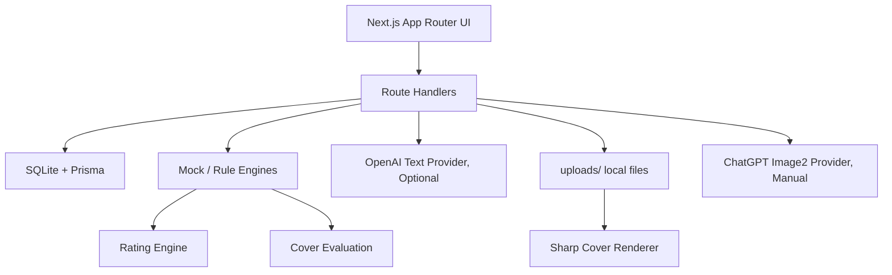
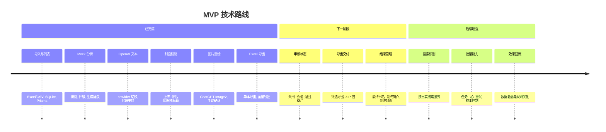

# 番茄畅畅听多书名运营辅助工具

> 面向有声书运营人员的本地化 MVP 工具：从作品导入、识别、评级、书名简介生成、封面评估，到 Excel 导出，形成一套可落地的多书名运营工作流。


## 项目定位

本项目服务于“不懂代码的有声书运营人员”，帮助运营团队批量处理作品资料，并快速判断：

- 哪些作品适合做多书名测试
- 哪些作品不建议轻易改名
- 哪些作品需要重新提炼卖点
- 当前封面应该保留、优化版式，还是后续重绘
- 最终如何把运营建议导出成可交付 Excel

系统默认优先使用 Mock / 本地规则跑通 MVP，OpenAI 能力以可选 provider 方式接入，避免默认消耗 API 成本。

## 已完成能力

| 模块 | 状态 | 说明 |
| --- | --- | --- |
| Excel / CSV 导入 | 已完成 | 支持预览、校验、重复检测、入库 |
| 作品列表与详情 | 已完成 | 支持搜索、筛选、分页、详情查看 |
| Mock 作品识别 | 已完成 | 候选作品、匹配分数、风险提示、人工确认 |
| SABCD 价值评级 | 已完成 | 规则引擎评级，多书名运营建议 |
| 书名/简介生成 | 已完成 | Mock 与 OpenAI provider 可切换 |
| 封面资产 | 已完成 | 支持本地上传与导入远程封面 URL |
| 封面评估 | 已完成 | 输出评分、评级、处理策略、人工确认 |
| 原图换标题 | 已完成 | 基于原封面生成 1:1 / 3:4 新版标题封面 |
| ChatGPT Image2 重绘 | 已完成 | 针对 redraw_cover 策略，成本确认后手动生成 |
| Excel 导出 | 已完成 | 支持单本和全部作品导出 |

## 工作流


## 技术架构



## 技术栈

- **Framework**: Next.js App Router
- **Language**: TypeScript
- **UI**: Tailwind CSS
- **Database**: SQLite
- **ORM**: Prisma 6
- **Excel**: xlsx
- **Image Composition**: sharp
- **AI Text**: OpenAI SDK, optional provider
- **Architecture**: Mock-first adapters, local-first MVP

## 本地运行

```bash
npm install
npm run db:push
npm run dev
```

默认访问：

```text
http://localhost:3000
```

## 常用命令

```bash
npm run dev
npm run lint
npm run typecheck
npm run build
npm run db:test
npm run db:push
npm run db:studio
```

OpenAI 文本链路测试：

```bash
npm run test:openai-text
npm run test:openai-title-intro
```

## 环境变量

复制 `.env.example` 为 `.env.local`，按需填写：

```env
OPENAI_API_KEY=
OPENAI_BASE_URL=
OPENAI_TEXT_MODEL=
OPENAI_TEXT_ENDPOINT=responses
OPENAI_TIMEOUT_MS=90000
OPENAI_PROXY_URL=
OPENAI_TITLE_INTRO_MAX_OUTPUT_TOKENS=3000
OPENAI_IMAGE_MODEL=
OPENAI_IMAGE_TIMEOUT_MS=120000
```

安全约束：

- 不要提交 `.env` 或 `.env.local`
- 不要把 API key 写入代码
- OpenAI 仅在用户主动选择 OpenAI provider 时调用
- ChatGPT Image2 仅在用户确认成本后手动调用
- 默认生成 provider 仍为 Mock

OpenAI 连接模式：

- 官方 OpenAI：不填 `OPENAI_BASE_URL`，只配置官方 API key 和模型名。
- OpenAI 兼容中转站：填写 `OPENAI_BASE_URL`，例如 `https://example.com/v1`，并使用中转站提供的 API key。
- `OPENAI_BASE_URL` 必须是 API 根地址，例如 `https://example.com/v1`，不要填写 `https://example.com/v1/chat/completions` 这类具体接口路径。
- 官方 OpenAI 文本生成推荐 `OPENAI_TEXT_ENDPOINT=responses`。
- 如果中转站报 `404 /v1/responses` 或不支持 Responses API，可以改为 `OPENAI_TEXT_ENDPOINT=chat_completions`。
- `OPENAI_BASE_URL` 是 API 目标地址，`OPENAI_PROXY_URL` 是本地网络代理地址，两者不要混用。
- 中转站可用模型名必须以中转站后台说明为准。

## 文件与数据

- SQLite 数据库用于本地存储作品和分析结果
- 上传封面与生成封面保存到 `uploads/`
- `uploads/` 不应提交到 Git
- 远程封面 URL 在导入阶段不会被批量下载入库

## Excel 导入

示例模板：

```text
sample/input-template.xlsx
```

封面字段支持：

- 本地封面文件名
- `http://` 或 `https://` 远程图片地址

远程图片地址会自动创建封面资产，并在作品详情页预览。

## Excel 导出

支持：

- 作品列表页导出全部作品 Excel
- 作品详情页导出当前作品 Excel

导出内容包含：

- 作品基础信息
- 作品识别结果
- SABCD 价值评级
- 书名与简介建议
- 封面评估结果
- 人工确认结果
- 新版封面结果
- ChatGPT Image2 重绘结果摘要

## 后续规划

### 近期优先

- **人工审核状态流**：补齐作品从生成建议到确认采用的完整审核状态
- **导出增强**：支持筛选导出、勾选导出、Excel + ZIP 交付包
- **封面结果管理**：选择某张新版封面作为最终采用结果

### 中期能力

- **真实搜索 API**：替换 MockSearchAdapter，增强作品识别准确率
- **单本作品录入**：不依赖 Excel，也能快速新增作品
- **批量任务中心**：展示任务进度、单条失败原因和重试入口

### 长期方向

- **运营效果回流**：导入测试后的点击率、播放量、完播率，用于优化评级规则
- **多版本 A/B 管理**：管理多个书名、简介、封面版本及其效果
- **团队协作与权限**：面向多人运营团队的审核、备注、导出协作
- **模板化封面系统**：沉淀不同题材的封面标题版式模板

## 技术路线



## 开发原则

- MVP 优先，先可用再复杂
- 所有外部服务必须有 Mock / fallback
- 网络失败不能导致整体流程崩溃
- 批量任务允许单条失败，不影响整体
- 不默认批量调用 OpenAI
- 不提交真实 API key、客户数据或真实封面文件
- 不使用 destructive Prisma 命令

## 当前状态

项目已经形成“导入 -> 分析 -> 生成 -> 封面处理 -> 重绘 -> 导出”的 MVP 闭环。下一步建议优先完善人工审核状态和导出交付包，而不是直接进入高成本的批量生成能力。

