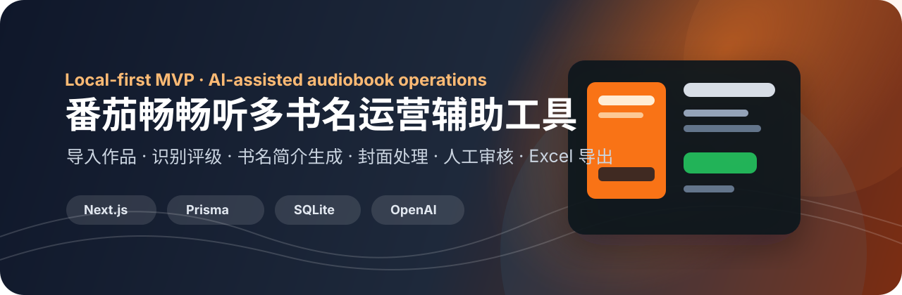
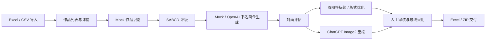

<div align="center">
  

  <h1>内容运营综合管理平台</h1>

  <p><strong>番茄畅畅听多书名运营辅助工具</strong></p>

  <p>
    面向有声书运营团队的本地优先 MVP：从作品导入、识别、评级、书名简介生成、封面评估、封面处理、人工审核到 Excel / ZIP 交付，沉淀一套可落地的内容运营工作流。
  </p>

  <p>
    
    
    
    
    
    
  </p>
</div>

---

## 项目概览

本项目服务于不懂代码的有声书运营人员，帮助运营团队批量处理作品资料，并快速判断：

- 哪些作品适合做多书名测试
- 哪些作品不建议轻易改名
- 哪些作品需要重新提炼卖点
- 当前封面应该保留、换标题、优化版式，还是后续重绘
- 最终采用哪一个书名、简介和封面
- 如何把运营建议导出成可交付 Excel / ZIP

系统默认优先使用 Mock / 本地规则跑通 MVP。OpenAI 文本生成和 ChatGPT Image2 封面重绘均为用户手动触发，不默认批量调用。

## 已完成能力

| 模块 | 状态 | 说明 |
| --- | --- | --- |
| Excel / CSV 导入 | 已完成 | 支持预览、校验、重复检测、入库 |
| 手动新增作品 | 已完成 | 支持单本录入、业务作品 ID、远程封面 URL 和本地封面上传 |
| 作品列表与详情 | 已完成 | 支持搜索、品类筛选、审核状态筛选、评级筛选、分页 |
| Mock 作品识别 | 已完成 | 候选作品、匹配分数、风险提示、人工确认 |
| SABCD 价值评级 | 已完成 | 规则引擎评级，多书名运营建议 |
| 书名 / 简介生成 | 已完成 | Mock 与 OpenAI provider 可切换 |
| 封面资产 | 已完成 | 支持本地上传和导入远程封面 URL |
| 封面评估 | 已完成 | 评分、评级、处理策略、人工确认 |
| 原图换标题 | 已完成 | 基于原封面生成 1:1 / 3:4 新版标题封面 |
| ChatGPT Image2 重绘 | 已完成 | 仅对单本作品手动确认成本后触发 |
| 人工审核与最终采用 | 已完成 | 保存最终书名、最终简介、最终封面和审核备注 |
| Excel 导出 | 已完成 | 支持单本、全部、当前筛选和勾选导出 |
| ZIP 交付包 | 已完成 | 包含 Excel 和已有最终封面文件 |
| 工作流提示 | 已完成 | 未识别、低置信度识别、人工确认识别对应不同评级提示 |

## 技术路线



## 后续计划

- 完善筛选导出、勾选导出和 ZIP 交付包的运营体验
- 增加批量任务结果中心，但继续保持单条失败不影响整体
- 接入真实搜索 API 前继续保留 MockSearchAdapter
- 图片生成保持默认关闭，避免 API 成本失控
- 增加更完整的人工审核状态流和交付版本管理

## 本地运行

```bash
npm install
npm run db:push
npm run dev
```

常用检查：

```bash
npm run typecheck
npm run lint
npm run build
npm run db:test
```

## 环境变量

请参考 `.env.example`。不要提交 `.env` 或 `.env.local`。

- `DATABASE_URL`：本地 SQLite 数据库
- `OPENAI_API_KEY`：仅服务端读取，不展示到前端
- `OPENAI_TEXT_MODEL`：文本生成模型
- `OPENAI_IMAGE_MODEL`：图片生成模型
- `OPENAI_PROXY_URL`：可选代理，支持 http / socks5 / socks5h

## 安全策略

- 不把 API key 写入代码
- 不提交本地数据库、上传图片、`.env`、`.env.local`
- OpenAI 仅用户主动选择时调用
- 图片生成不做默认批量任务
- 所有外部服务都保留 Mock 或本地 fallback
