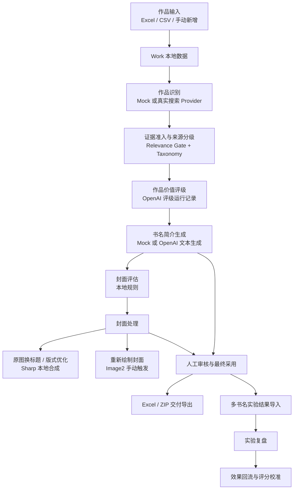

# 核心功能与算法实现审计

更新时间：2026-05-31

## 1. 审计说明

本文档基于当前仓库代码静态阅读整理，目标是说明系统现有功能如何实现、哪些链路已经成为正式主流程、哪些模块仍属于 Mock 或兼容逻辑，以及后续开发时需要保留的边界。

本次审计只新增本文档，没有修改业务代码、数据库模型、配置逻辑或页面行为。当前工作区在审计开始前已经存在阶段 21.2、21.2.1 和上传模板相关的未提交改动，本文档按当前工作区实际代码审计。

## 2. 项目定位与当前架构

项目名称：内容运营综合管理平台  
业务副标题：番茄畅听多书名运营辅助工具

当前系统采用本地优先、Mock-first、外部能力手动触发的 MVP 架构：



主要技术栈：

| 层级 | 当前实现 |
| --- | --- |
| 前端 | Next.js App Router + TypeScript + Tailwind CSS |
| 后端 | Next.js Route Handler，显式使用 Node.js runtime |
| 数据库 | SQLite + Prisma 6.19.3 |
| 表格处理 | `xlsx` |
| 图片处理 | `sharp` |
| OpenAI SDK | `openai` |
| 结构校验 | `zod` 与局部轻量校验 |
| 网络代理 | HTTP/HTTPS 与 SOCKS5/SOCKS5H，服务端显式代理 |
| 批量任务 | 本地数据库任务记录 + 当前 Node 进程顺序执行 |

## 3. 数据模型概览

核心数据围绕 `Work` 聚合：

| 模型 | 用途 |
| --- | --- |
| `Work` | 作品基础信息、业务作品 ID、内容类型、基础指标、审核最终采用结果 |
| `AnalysisResult` | 早期 Mock 分析兼容模型，不是当前正式主链路 |
| `WorkIdentification` | 识别候选、最终匹配、搜索证据、人工确认结果 |
| `WorkRating` | 当前采用的评级投影，供页面和导出快速读取 |
| `WorkRatingRun` | OpenAI 评级运行快照、诊断、结果、采用状态 |
| `WorkRatingSupplement` | 评级补充材料 |
| `WorkTitleIntroGeneration` | 书名、简介、封面 Prompt 生成结果 |
| `CoverAsset` | 本地上传或远程 URL 封面资产 |
| `WorkCoverEvaluation` | 封面规则评估与人工确认策略 |
| `WorkCoverRender` | 原图换标题、版式优化和 Image2 重绘结果 |
| `BatchJob` / `BatchJobItem` | 批量任务与单条执行状态 |
| `ExperimentResult` | 多书名测试导入明细 |
| `ExperimentReview` | 实验复盘结论与最终采用记录 |
| `FeedbackInsight` | 效果回流和评分校准洞察 |

实现特征：

- 多数分析结果使用 JSON 字符串保存快照，便于 MVP 快速演进。
- `Work.externalId` 是业务作品 ID，不是数据库主键；当前允许为空，也没有数据库唯一约束。
- 重复作品主要在导入校验和 API 层处理。
- `Work.contentType` 使用字符串保存，并在导入、创建和编辑时归一化，兼容历史数据。
- 最终采用结果保存在 `Work` 上，实验、生成和封面结果保留历史记录，不被覆盖删除。

## 4. 功能实现总览

| 功能 | 当前实现方式 | 主文件 | 状态 |
| --- | --- | --- | --- |
| Excel / CSV 导入 | 表头别名映射、逐行校验、重复跳过、远程封面资产自动创建 | `src/lib/import/*`、`src/app/api/import/works/route.ts` | 已实现 |
| 手动新增作品 | 表单校验后写入 `Work`，可上传本地封面或填写远程 URL | `src/app/works/new/*`、`src/app/api/works/route.ts` | 已实现 |
| 作品列表与详情 | Prisma 读取、筛选、分页、批量勾选、状态展示 | `src/app/works/*` | 已实现 |
| 作品识别 | Mock / 真实搜索 Provider、扩展 query、相关性门槛、失败 fallback | `src/lib/adapters/search-adapter.ts` | 已实现 |
| 搜索证据准入 | 来源分层、去重、相关性过滤、音频场景加权 | `src/lib/evidence/*` | 已实现 |
| 价值评级 | OpenAI 正式评级运行记录、人工采用、补充材料 | `src/lib/rating/openai-rating-*` | 已实现，规则评级保留兼容 |
| 书名简介生成 | Mock 规则引擎或 OpenAI 文本 Provider，结构化保存 | `src/lib/generation/*` | 已实现 |
| 封面资产 | 本地上传、远程 URL 代理预览、安全限制 | `src/lib/cover/*`、封面 API | 已实现 |
| 封面评估 | 文件元数据与业务信息规则评分，不做视觉识别 | `src/lib/cover/cover-evaluator.ts` | 已实现，属于 Mock 规则 |
| 原图换标题 | Sharp 本地合成，输出 1:1 与 3:4 | `src/lib/cover-render/*` | 已实现 |
| 封面重绘 | OpenAI Image2 Adapter，用户确认费用后单本触发 | `src/lib/image-generation/*` | 已实现，非批量 |
| 人工审核 | 保存最终书名、简介、封面和备注 | `src/app/api/works/[id]/review/route.ts` | 已实现 |
| Excel / ZIP 导出 | 聚合最新记录和最终采用结果，缺失数据不中断 | `src/lib/export/*` | 已实现 |
| 批量任务 | 本地顺序执行、单条失败隔离、失败重试、Provider 显式记录 | `src/lib/batch-jobs/*` | 已实现，非队列 |
| 实验结果导入 | Excel / CSV 校验、分组、复盘评分、人工采用 | `src/lib/experiments/*` | 已实现 |
| 效果回流 | 规则化洞察与策略标签，不覆盖正式结果 | `src/lib/feedback/*` | 已实现 |
| Dashboard | Prisma 聚合统计，不使用旧 Mock 统计 | `src/app/page.tsx` | 已实现 |
| 设置页 | 只展示配置状态，不展示密钥 | `src/app/settings/page.tsx` | 已实现 |

## 5. 输入与数据接入

### 5.1 Excel / CSV 导入

相关文件：

- `src/lib/import/columns.ts`
- `src/lib/import/validation.ts`
- `src/app/api/import/works/route.ts`
- `src/app/import/import-client.tsx`

实现方式：

1. 前端解析 `.xlsx` 或 `.csv`，将表头映射为统一字段。
2. 表头兼容中文和英文别名，例如业务作品 ID、书名、作者、简介、分类、封面文件或封面地址。
3. 校验函数逐行生成错误与警告：
   - 书名为空：错误。
   - 播放量非法：错误。
   - 点击率、完播率格式异常：错误。
   - 缺少业务作品 ID、作者、简介、品类、封面：警告。
   - 同文件重复：警告或跳过依据。
4. API 再检查数据库中是否存在重复作品，避免同一作品重复入库。
5. 每条数据独立写入；单条失败不会阻止其他作品导入。

指标归一化：

- 播放量转换为非负整数。
- 百分比支持 `12%`、`0.12` 和合理范围内的整数百分比。
- 缺失指标保持为空，不会阻止导入。

封面字段处理：

- 如果内容是 `http://` 或 `https://` URL，则创建 `CoverAsset`，类型为 `remote_url`。
- 导入阶段不阻塞下载远程图片，避免批量导入被网络拖慢。
- 如果内容不是 URL，则保留为封面文件名，不强制创建资产。

### 5.2 手动新增作品

相关文件：

- `src/app/works/new/page.tsx`
- `src/app/works/new/new-work-form.tsx`
- `src/app/api/works/route.ts`

实现方式：

- 运营人员可以录入业务作品 ID、书名、作者、简介、分类、备注、基础指标、内容类型。
- 数据库内部 `id` 仍由 Prisma 自动生成，页面填写的作品 ID 写入 `externalId`。
- 封面 URL 会创建远程封面资产。
- 本地封面上传复用现有上传逻辑。
- 创建成功后跳转到作品详情页。

## 6. 作品识别与搜索证据

### 6.1 Provider 设计

相关文件：

- `src/lib/adapters/search-adapter.ts`
- `src/app/api/works/[id]/identify/route.ts`
- `src/app/api/works/[id]/identify/confirm/route.ts`

当前支持：

| Provider | 行为 |
| --- | --- |
| Mock | 使用本地规则生成候选作品，不调用网络 |
| Real / Custom | 使用服务端搜索配置请求真实搜索服务 |
| 百度千帆兼容路径 | 对特定 URL 使用对应 POST 请求格式 |

真实搜索链路根据作品书名、作者、业务 ID、分类、内容类型构造 query。扩展 query 数量、请求间隔、超时、最大结果数和 HTTP 429 重试次数均可通过服务端环境变量调整。

真实搜索失败时：

- 本次识别会明确记录失败信息。
- 可以使用 Mock fallback 保持页面可用。
- fallback 结果会标记风险，不应直接作为正式识别依据。

### 6.2 Relevance Gate

阶段 16.3 后，搜索结果先经过证据准入门槛，再进入候选列表和评级输入。

核心区分：

| 分数 | 用途 |
| --- | --- |
| `relevanceScore` | 判断搜索结果是否确实与当前作品相关 |
| `valueSignalScore` | 在结果已经相关的前提下，衡量 IP、热度、平台信号价值 |

主要规则：

- 标题一致或高度相似会提高相关性。
- 作者一致会提高相关性。
- 分类、来源平台、内容类型等信号参与判断。
- 重名、作者冲突、明显无关标题会降低相关性。
- 未通过准入门槛的搜索结果：
  - 不展示为有效候选。
  - 不进入来源摘要。
  - 不进入 IP 或热度统计。
  - 不参与评级。

正式搜索匹配和评级始终使用导入表格或手动录入的 `Work.title` 与 `Work.author`。历史 `confirmedTitle` / `confirmedAuthor` 只保留为兼容信息，不再覆盖作品基础信息，也不是继续评级的前置条件。

### 6.3 来源分级与去重

相关文件：

- `src/lib/evidence/source-taxonomy.ts`

证据按来源质量分级：

| Tier | 来源类型 | 使用原则 |
| --- | --- | --- |
| Tier 0 | 盗版、聚合或低可信来源 | 过滤，不作为评级依据 |
| Tier 1 | 官方、版权方、主要平台 | 高优先级证据 |
| Tier 2 | 分发平台 | 可作为补充 |
| Tier 3 | 音频平台 | 有声内容场景下提高权重 |
| Tier 4 | 社交传播、IP 热度 | 仅在相关性通过后作为价值信号 |
| Tier 5 | 普通网页 | 低权重补充，不应压过可信来源 |

同一来源域名或平台会归一化去重，保留更相关的记录。对于有声书等内容类型，音频平台证据会获得更高业务权重。

## 7. 作品价值评级

### 7.1 当前正式链路

相关文件：

- `src/lib/rating/openai-rating-service.ts`
- `src/lib/rating/openai-rating-provider.ts`
- `src/lib/rating/rating-types.ts`
- `src/app/api/works/[id]/rating/route.ts`
- `src/app/api/works/[id]/rating/run/route.ts`
- `src/app/api/works/[id]/rating/rerun/route.ts`
- `src/app/api/works/[id]/rating/runs/route.ts`
- `src/app/api/works/[id]/rating/runs/[runId]/adopt/route.ts`
- `src/app/api/works/[id]/rating-supplements/route.ts`

阶段 21.2 后，正式评级采用 OpenAI 运行记录模式。阶段 21.3B 进一步明确：`Work.title` 和 `Work.author` 是匹配与评级的权威源，外部搜索作者差异只用于过滤搜索结果，不得降低作品价值评分。

1. 读取作品基础字段。
2. 读取最近识别结果和人工确认身份。
3. 使用 `Work.title` / `Work.author` 对搜索证据再次执行 relevance gate。
4. 选取通过准入的可信证据。
5. 读取封面评估摘要、实验复盘、历史洞察、补充材料和上一版采用结果。
6. 创建 `WorkRatingRun` 快照。
7. 调用 OpenAI 评级 Provider。
8. 使用 Zod 和业务约束校验结构化输出。
9. 成功后保存运行结果。
10. 用户采用某次运行后，写入 `WorkRating` 当前投影。

关键边界：

- OpenAI 评级失败时，不覆盖当前已采用评级。
- OpenAI 评级失败时，不静默回退到旧规则评级。
- 作品备注不会直接进入评级分数计算；备注仅作为运营生成上下文。
- 封面质量摘要可以作为边界信息，但不应直接降低作品内容价值评分。
- 缺少官方或音频证据应记录为信息不足，不应直接推断作品价值低。

### 7.2 输出校验

Provider 输出必须通过结构化校验，避免模型自由文本直接入库。业务规则还会拒绝以下不合理结果：

- 因封面质量差而直接降低作品内容评级。
- 因缺少音频证据而直接降级。
- 因外部搜索作者差异产生的作品价值扣分依据。
- 使用盗版或聚合来源作为核心证据。
- 有高可信来源时仍以普通网页作为主要判断依据。

### 7.3 历史规则评级

相关文件：

- `src/lib/rating/rating-engine.ts`

仓库仍保留纯 TypeScript 规则评级引擎。它曾用于早期 MVP，可处理识别置信度、标题吸引力、简介密度、题材商业性、播放量、点击率、完播率和重名风险。

当前定位：

- 不是阶段 21.2 后的正式评级主流程。
- 可作为历史兼容、测试样例或未来离线 fallback 的基础。
- 如果未来重新启用 fallback，必须在页面和导出中显式标记来源，禁止和正式 OpenAI 评级混用。

## 8. 书名、简介与封面 Prompt 生成

### 8.1 Mock 规则引擎

相关文件：

- `src/lib/generation/title-intro-types.ts`
- `src/lib/generation/title-intro-engine.ts`
- `src/lib/generation/title-intro-repository.ts`

纯函数根据评级中的 `renameSuggestion` 决定策略：

| 评级建议 | 生成策略 | 行为 |
| --- | --- | --- |
| `avoid` | `keep_original` | 保留原名，只做轻度简介建议 |
| `cautious` | `minor_optimization` | 生成少量轻度优化书名 |
| `recommended` | `rename_test` | 生成多书名测试方案 |
| `strongly_recommended` | `heavy_repackage` | 强化冲突、爽点和包装方向 |

生成结果包括：

- 是否建议多书名方案。
- 生成策略和说明。
- 候选书名列表。
- 新版简介。
- 1:1 和 3:4 封面 Prompt。
- 风险与证据信息。

备注字段会进入生成上下文，可用于运营卖点判断，但不会反向修改价值评级。

### 8.2 OpenAI 文本生成

相关文件：

- `src/lib/generation/llm/openai-title-intro-adapter.ts`
- `src/lib/generation/llm/openai-client.cjs`
- `src/lib/generation/llm/openai-proxy.ts`
- `src/lib/generation/llm/title-intro-json-schema.ts`
- `src/app/api/works/[id]/title-intro/route.ts`

实现方式：

- API 默认 Provider 仍为 Mock。
- 只有用户主动选择 OpenAI 时才调用外部服务。
- OpenAI Adapter 支持 Responses API 和 Chat Completions 兼容端点。
- 输出必须符合 JSON Schema，并通过运行时校验。
- 保存时仍写入同一个 `WorkTitleIntroGeneration` 模型，前端无需区分两套结构。
- OpenAI 错误会结构化返回，不静默回退 Mock。

代理支持：

- `http://`
- `https://`
- `socks5://`
- `socks5h://`

HTTP 代理使用 `undici`，SOCKS 代理使用 `socks-proxy-agent` 与 `node-fetch`。代理逻辑集中复用，避免测试脚本和页面调用路径不一致。

## 9. 封面资产、评估与处理

### 9.1 封面资产

相关文件：

- `src/lib/cover/cover-types.ts`
- `src/lib/cover/cover-repository.ts`
- `src/app/api/works/[id]/cover/route.ts`
- `src/app/api/cover-assets/[id]/file/route.ts`

支持两类来源：

| 类型 | 实现 |
| --- | --- |
| `local_upload` | 保存到本地 `uploads` 目录 |
| `remote_url` | 保存 URL 元数据，预览时由服务端代理获取 |

上传限制：

- 文件类型限制为常见图片格式。
- 文件大小限制为 5 MB。
- 不应将真实上传图片提交到 Git。

远程图片代理限制：

- 只允许 HTTP / HTTPS。
- 阻止 localhost、回环地址和常见私网 IPv4 段。
- 设置请求超时。
- 校验响应 `content-type` 必须是图片。
- 限制最大响应体大小。
- 错误响应不泄露服务器本地路径。

### 9.2 封面规则评估

相关文件：

- `src/lib/cover/cover-evaluator.ts`
- `src/app/api/works/[id]/cover/evaluate/route.ts`
- `src/app/api/works/[id]/cover/confirm/route.ts`

当前封面评估不是视觉模型，而是本地规则评估。它根据资产来源、图片元数据、文件大小、文件名、书名关键词和品类信息生成：

- `score`
- `rating`
- `strengths`
- `weaknesses`
- `strategy`
- `reason`

策略：

| 策略 | 用途 |
| --- | --- |
| `keep_and_replace_title` | 保留主体，仅替换标题 |
| `keep_and_optimize_layout` | 保留主体，增加底板或调整版式 |
| `redraw_cover` | 进入重绘路径 |

边界：当前评分不分析真实像素语义，只能作为运营流程占位和人工判断辅助，不能当作视觉质量模型。

### 9.3 原图换标题与版式优化

相关文件：

- `src/lib/cover-render/cover-render-service.ts`
- `src/lib/cover-render/cover-render-repository.ts`
- `src/app/api/works/[id]/cover/render/route.ts`
- `src/app/api/cover-renders/[id]/file/route.ts`

实现方式：

1. 读取本地或远程封面。
2. 使用 Sharp 旋转、缩放、裁切。
3. 生成带背景遮罩的 SVG 标题层。
4. 根据标题长度自动换行和缩放字号。
5. 输出 1:1 与 3:4 两种尺寸。
6. 保存到 `uploads/cover-renders/{workId}/`。
7. 写入 `WorkCoverRender`，Provider 为本地 Sharp。

### 9.4 Image2 重绘

相关文件：

- `src/lib/image-generation/image-generation-types.ts`
- `src/lib/image-generation/image-generation-adapter.ts`
- `src/lib/image-generation/openai-image2-adapter.ts`
- `src/lib/image-generation/image-generation-service.ts`
- `src/app/api/works/[id]/cover/redraw/route.ts`

实现方式：

- 只处理 `redraw_cover` 路径。
- 用户必须明确确认成本，才会调用图片生成。
- 根据作品、候选书名、简介、分类、评级、封面弱点和策略原因组装 Prompt。
- 输出 1:1 与 3:4 两种比例。
- 每种比例独立保存成功或失败记录，避免一张失败导致全部失败。
- 成功文件保存到 `uploads/cover-redraws/{workId}/`。
- 继续复用 `WorkCoverRender`，Provider 标记为 Image2。

边界：

- 不默认调用。
- 不支持批量自动重绘。
- 不提交真实生成图片。

## 10. 人工审核与最终采用

相关文件：

- `src/app/api/works/[id]/review/route.ts`
- `src/app/works/[id]/work-review-panel.tsx`

支持审核状态：

- 待审核
- 已采用
- 需修改
- 暂缓
- 已退回

人工审核可以保存：

- 最终书名。
- 最终简介。
- 最终封面资产或生成封面。
- 最终封面来源。
- 审核备注。
- 审核人。
- 审核时间。

最终采用结果写入 `Work`，但历史识别、评级、生成和封面处理记录不会删除。

当前限制：系统没有登录和权限控制，审核人属于手动填写或业务字段，不是可信身份认证。

## 11. 批量任务

相关文件：

- `src/lib/batch-jobs/batch-job-service.ts`
- `src/app/api/batch-jobs/route.ts`
- `src/app/api/batch-jobs/[id]/route.ts`
- `src/app/api/batch-jobs/[id]/items/[itemId]/retry/route.ts`
- `src/app/analysis/*`

支持步骤：

- 作品识别。
- 价值评级。
- 书名简介生成。
- 封面评估。

执行模型：

1. 创建 `BatchJob` 和每本作品对应的 `BatchJobItem`。
2. 当前 Node 进程后台启动顺序执行。
3. 单条作品失败只标记当前 Item，不阻止其他作品。
4. 汇总任务状态：成功、部分成功、失败等。
5. 失败 Item 可以单独重试。

Provider 与费用控制：

- 识别可以选择 Mock 或已配置真实搜索。
- 书名简介可以选择 Mock 或 OpenAI。
- OpenAI 评级属于真实外部调用。
- 涉及真实搜索或 OpenAI 时，必须显式确认成本风险。
- OpenAI 文本配置缺失或调用失败时，不允许静默回退 Mock。
- 每条 Item 的摘要记录实际 Provider。
- 图片生成不进入批量任务。

当前限制：

- 不是 Redis、BullMQ 或独立 Worker。
- Node 进程重启后，运行中任务没有自动恢复机制。
- 适合本地 MVP 和有限批量，不适合长时间无人值守的大规模处理。

## 12. 多书名测试、复盘与效果回流

### 12.1 实验结果导入

相关文件：

- `src/lib/experiments/*`
- `src/app/api/experiments/import/route.ts`
- `src/app/api/experiments/template/route.ts`

实现方式：

- 支持 Excel / CSV。
- 解析作品、实验组、曝光、点击、转化、完播率、收入、日期和封面 URL 等字段。
- 每行独立校验，单条失败不影响整体。
- 导入后保存 `ExperimentResult`。

### 12.2 实验复盘

系统将 control 和 variant 分组比较，生成 `ExperimentReview`。

当前规则为确定性 MVP 规则：

```text
valueScore = CTR * 100 + 转化率 * 120 + 完播率 * 35 + 收入 / 1000
```

结论规则包括：

- 曝光不足：建议继续收集数据。
- 点击率和转化率均提升：建议采用。
- 点击提升但转化缺失或下降：建议继续观察。
- 点击率和转化率均下降：建议回退。
- 其他情况：建议继续收集数据。

置信度粗略依据曝光量和 CTR 差异划分高、中、低。

边界：

- 当前没有复杂统计显著性检验。
- 不属于机器学习模型。
- 自动复盘不会直接覆盖最终采用结果。
- 只有用户明确执行采用操作后，才更新最终结果。

### 12.3 效果回流与评分校准

相关文件：

- `src/lib/feedback/feedback-service.ts`
- `src/app/api/works/[id]/feedback-insight/route.ts`

基于实验复盘、当前采用评级、封面评估和最终采用信息生成 `FeedbackInsight`：

- `actualOutcome`
- `ratingAccuracy`
- `titleStrategyEffect`
- `coverStrategyEffect`
- `keyLiftMetric`
- 策略标签

策略标签示例：

- 强冲突标题有效。
- 点击提升但转化下降。
- 原封面更稳定。
- 曝光不足。
- 高认知 IP 不宜大改名。

边界：

- 当前为本地规则洞察，不做模型训练。
- 不自动改写评级。
- 不自动覆盖最终采用结果。

## 13. Excel 与 ZIP 导出

相关文件：

- `src/lib/export/export-service.ts`
- `src/lib/export/export-excel.ts`
- `src/lib/export/export-zip.ts`
- `src/app/api/export/works/route.ts`
- `src/app/api/export/works/[id]/route.ts`
- `src/app/api/export/works/zip/route.ts`

聚合内容：

- 作品基础信息。
- 最近一次识别结果。
- 当前采用评级和评级来源。
- 最近一次书名简介生成。
- 最近封面资产。
- 最近封面评估。
- 封面换标题和 Image2 重绘结果摘要。
- 审核状态与最终采用结果。
- 实验复盘结果。
- 效果回流洞察。

实现原则：

- 缺失数据写空字符串或“未生成”，不会中断整份导出。
- JSON 字段解析失败时降级处理，不让导出崩溃。
- 最终采用结果优先展示，同时保留建议摘要。
- 数组字段使用中文分号拼接。
- 不导出 API key。
- 不导出服务器绝对路径。
- ZIP 包含 Excel 和已有最终封面文件；没有最终封面时只标记缺失，不阻止整个包导出。

ZIP 当前为轻量本地实现，不引入额外压缩框架。远程封面不会在导出时默认下载并塞入 ZIP。

## 14. Dashboard、设置页与页面组织

### 14.1 Dashboard

相关文件：

- `src/app/page.tsx`

Dashboard 直接使用 Prisma 聚合，不使用早期 Mock 统计：

- 已导入、已识别、已评级、已生成、已审核、待审核数量。
- 评级分布。
- 封面策略分布。
- 审核状态分布。
- 工作流和实验反馈概览。
- 快捷入口和下一步建议。

### 14.2 设置页

相关文件：

- `src/app/settings/page.tsx`

设置页只展示配置状态：

- API key 是否存在。
- 模型名。
- Base URL host。
- 代理协议。
- 数据库类型。
- 成本策略。

安全边界：

- 不展示 API key 的前缀或后缀。
- 不展示完整代理地址。
- 不在浏览器侧读取服务端 API key。

### 14.3 页面入口

主要页面：

| 路径 | 用途 |
| --- | --- |
| `/` | 运营 Dashboard |
| `/import` | Excel / CSV 导入 |
| `/works` | 作品列表、筛选、分页、勾选导出、批量操作 |
| `/works/new` | 手动新增作品 |
| `/works/[id]` | 单本作品完整运营详情 |
| `/analysis` | 批量任务结果中心 |
| `/settings` | 系统配置状态 |

## 15. API 路由清单

### 15.1 作品与导入

| 路由 | 方法 | 用途 |
| --- | --- | --- |
| `/api/works` | `POST` | 手动新增作品 |
| `/api/works/[id]` | `PATCH` | 编辑作品基础字段 |
| `/api/import/works` | `POST` | 批量导入作品 |
| `/api/import/check-duplicates` | `POST` | 导入前重复检查 |
| `/api/import/template` | `GET` | 下载作品导入模板 |

### 15.2 识别、评级与生成

| 路由 | 方法 | 用途 |
| --- | --- | --- |
| `/api/works/[id]/identify` | `POST` | 运行作品识别 |
| `/api/works/[id]/identify/confirm` | `POST` | 人工确认作品身份 |
| `/api/works/[id]/rating` | `GET` / `POST` | 读取评级或兼容触发评级 |
| `/api/works/[id]/rating/run` | `POST` | 新建 OpenAI 评级运行 |
| `/api/works/[id]/rating/rerun` | `POST` | 基于现状重新评级 |
| `/api/works/[id]/rating/runs` | `GET` | 读取评级运行历史 |
| `/api/works/[id]/rating/runs/[runId]/adopt` | `POST` | 采用指定评级运行 |
| `/api/works/[id]/rating-supplements` | `GET` / `POST` | 评级补充材料 |
| `/api/works/[id]/rating-supplements/[supplementId]` | `DELETE` | 删除补充材料 |
| `/api/works/[id]/title-intro` | `GET` / `POST` | 读取或生成书名简介建议 |

### 15.3 封面

| 路由 | 方法 | 用途 |
| --- | --- | --- |
| `/api/works/[id]/cover` | `GET` / `POST` | 读取或上传封面资产 |
| `/api/cover-assets/[id]/file` | `GET` | 返回本地或远程封面文件 |
| `/api/works/[id]/cover/evaluate` | `GET` / `POST` | 读取或运行封面评估 |
| `/api/works/[id]/cover/confirm` | `POST` | 人工确认封面策略 |
| `/api/works/[id]/cover/render` | `GET` / `POST` | 原图换标题和版式优化 |
| `/api/works/[id]/cover/redraw` | `GET` / `POST` | Image2 重绘 |
| `/api/cover-renders/[id]/file` | `GET` | 返回生成封面文件 |

### 15.4 审核、实验、回流与导出

| 路由 | 方法 | 用途 |
| --- | --- | --- |
| `/api/works/[id]/review` | `GET` / `POST` | 最终采用结果与审核状态 |
| `/api/experiments/import` | `POST` | 导入多书名测试结果 |
| `/api/experiments/template` | `GET` | 下载实验结果模板 |
| `/api/works/[id]/experiment-review/adopt` | `POST` | 采用实验复盘胜出方案 |
| `/api/works/[id]/feedback-insight` | `GET` / `POST` | 读取或生成效果洞察 |
| `/api/export/works` | `GET` | 导出筛选后的全部作品 Excel |
| `/api/export/works/[id]` | `GET` | 导出单本作品 Excel |
| `/api/export/works/zip` | `GET` | 导出 Excel 与已有封面 ZIP |

### 15.5 批量任务

| 路由 | 方法 | 用途 |
| --- | --- | --- |
| `/api/batch-jobs` | `GET` / `POST` | 查询或创建批量任务 |
| `/api/batch-jobs/[id]` | `GET` | 查询任务详情 |
| `/api/batch-jobs/[id]/items/[itemId]/retry` | `POST` | 重试单条失败任务 |

## 16. 服务端环境变量

本节只列变量名，不展示当前值。

### 16.1 数据库

- `DATABASE_URL`

### 16.2 OpenAI 文本与评级

- `OPENAI_API_KEY`
- `OPENAI_BASE_URL`
- `OPENAI_TEXT_MODEL`
- `OPENAI_TEXT_ENDPOINT`
- `OPENAI_RATING_MODEL`
- `OPENAI_TIMEOUT_MS`
- `OPENAI_PROXY_URL`

### 16.3 图片生成

- `OPENAI_IMAGE_MODEL`

### 16.4 搜索

- `SEARCH_PROVIDER`
- `SEARCH_API_KEY`
- `SEARCH_BASE_URL`
- `SEARCH_TIMEOUT_MS`
- `SEARCH_MAX_RESULTS`
- `SEARCH_EXPANDED_QUERY_COUNT`
- `SEARCH_REQUEST_DELAY_MS`
- `SEARCH_QIANFAN_RETRY_COUNT`
- `SEARCH_QIANFAN_RETRY_DELAY_MS`

## 17. 安全与稳定性审计

### 17.1 已有保护

| 项目 | 当前保护 |
| --- | --- |
| API key | 服务端环境变量读取，不进入页面，不写入导出 |
| 本地 env 文件 | `.gitignore` 忽略 `.env`、`.env.local`、`.env.*.local` |
| 上传目录 | `.gitignore` 忽略 `uploads` |
| SQLite 文件 | `.gitignore` 忽略本地数据库与 journal 文件 |
| OpenAI 调用 | 默认 Mock，只有用户主动选择才触发；图片生成还要求确认费用 |
| 批量任务 | 单条失败隔离，不默认批量生成图片 |
| JSON 读取 | 多数历史 JSON 字段使用安全解析和降级值 |
| 远程封面 | 协议、私网 IPv4、超时、响应类型、响应大小限制 |

### 17.2 需要后续加固

| 优先级 | 问题 | 影响 | 建议 |
| --- | --- | --- | --- |
| 高 | 当前没有登录、权限和操作审计身份校验 | 多人部署时无法确认操作者身份 | 在部署到共享环境前增加最小登录和角色控制 |
| 高 | 远程封面 SSRF 防护主要基于输入 hostname 和显式 IPv4 段 | DNS 解析、跳转目标或 IPv6 边界仍需补强 | fetch 前解析 DNS，校验所有地址；限制跳转或逐跳校验 |
| 高 | 批量任务依赖当前 Node 进程后台执行 | 进程重启会中断运行中任务 | 增加启动恢复、租约或独立 Worker，再考虑队列 |
| 中 | `externalId` 没有数据库唯一约束 | 并发写入时应用层重复检查可能被绕过 | 明确业务唯一键后，清理历史重复，再安全增加唯一约束 |
| 中 | 大量业务快照保存为 JSON 字符串 | 字段演进和历史兼容依赖手动解析 | 为 JSON 快照增加版本号，并集中定义解析器 |
| 中 | 封面规则评估不读取像素语义 | 评分可能与真实视觉质量不一致 | 保持“规则评估”标签；后续可增加可选视觉 Provider |
| 中 | 实验复盘没有统计显著性检验 | 小样本可能产生误导性结论 | 增加最小样本门槛、置信区间或显著性提示 |
| 中 | 部分用户文案和旧文档存在编码异常迹象 | 可读性下降，可能影响交付 | 统一 UTF-8，逐步清理历史文档与旧字符串 |
| 低 | `AnalysisResult`、早期 Mock 数据与旧规则评级仍保留 | 新开发者可能误用旧链路 | 标注 legacy，逐步隔离到兼容目录 |

## 18. 测试与验证入口

已有脚本：

| 命令 | 用途 |
| --- | --- |
| `npm run typecheck` | TypeScript 类型检查 |
| `npm run lint` | ESLint |
| `npm run build` | Prisma generate + Next build |
| `npm run db:test` | Prisma 连接与实际查询 |
| `npm run db:test-import` | Work 写入查询 |
| `npm run db:test-rating` | 评级保存查询 |
| `npm run db:test-rating-openai` | OpenAI 评级数据库链路 |
| `npm run test:rating-evidence` | 搜索证据准入与评级证据测试 |
| `npm run db:test-title-intro` | 书名简介生成保存查询 |
| `npm run test:openai-text` | 最小 OpenAI 文本链路 |
| `npm run test:openai-title-intro` | 与页面相同的书名简介 OpenAI Adapter |
| `npm run test:search` | 搜索候选、过滤原因、有效 IP 与热度证据 |

本次审计没有执行这些运行命令，因为任务范围是静态审计和文档输出，不修改业务代码。阶段提交前仍应按 `AGENTS.md` 执行规定检查。

## 19. 当前正式主流程

后续维护时，应将以下流程视为当前正式业务链路：

1. 导入或手动新增作品。
2. 使用 Mock 或已配置真实搜索执行作品识别。
3. 搜索结果经过 relevance gate 和来源分级。
4. 必要时人工确认作品身份。
5. 使用 OpenAI 评级运行记录生成正式评级，并人工采用。
6. 使用 Mock 或 OpenAI 生成书名、简介与封面 Prompt。
7. 上传或读取封面资产，运行本地规则封面评估。
8. 根据人工确认策略执行原图换标题或手动 Image2 重绘。
9. 人工选择最终书名、简介与封面。
10. 导出 Excel 或 ZIP 交付包。
11. 导入多书名实验数据，生成复盘与效果回流洞察。

需要避免的混用：

- 不要把 Mock 搜索 fallback 当作正式识别依据。
- 不要把旧规则评级当作阶段 21.2 后的正式评级。
- 不要把封面规则评估描述成 OpenAI 视觉评估。
- 不要在未确认费用时批量调用 OpenAI 或图片生成。
- 不要让实验复盘自动覆盖人工最终采用结果。

## 20. 后续开发建议

### 20.1 第一优先级：稳定性与交付

1. 为批量任务增加重启恢复机制。
2. 为远程封面代理补齐 DNS、IPv6 和跳转目标 SSRF 校验。
3. 统一历史文档和页面字符串编码。
4. 为 JSON 快照增加版本号和集中解析器。
5. 增加关键 API 的集成测试，覆盖缺失配置、外部失败和单条失败隔离。

### 20.2 第二优先级：运营可解释性

1. 在页面清晰区分 Mock、真实搜索、OpenAI、规则评估和 Image2。
2. 将评级证据准入诊断做成运营可读摘要。
3. 对实验复盘增加样本量不足提示和最小显著性判断。
4. 增加正式采用前的审核清单。

### 20.3 第三优先级：共享部署准备

1. 增加登录和最小角色权限。
2. 将上传文件迁移到受控对象存储。
3. 将 SQLite 替换为适合多人并发的数据库。
4. 将本地后台任务替换为独立 Worker 和持久队列。
5. 增加服务端操作日志、调用成本统计和失败告警。

## 21. 审计结论

当前项目已经形成完整的本地运营闭环：作品输入、识别、证据过滤、正式评级、内容生成、封面处理、人工审核、交付导出、实验复盘和效果回流均有可运行实现。

阶段 21.3B 补充边界：本地 evidence gate 只做预处理和诊断，不做 IP、影视、社媒热度或作者影响力的最终语义裁判；正式语义理解和作品价值评级由 OpenAI 根据明确原始证据完成。缺失证据、外部作者不一致和封面低分均不得作为作品价值默认扣分项。

阶段 21.3C 补充边界：OpenAI rating run 的 `invalid` / `failed` 状态会映射为运营可读中文提示，且不会覆盖当前采用评级。旧 rules 评级明确标记为 `legacy_rules / 历史规则评级`，只用于历史兼容、规则样例和诊断，不得作为阶段 21.2 之后的正式作品价值评级。批量 rating step 仍只调用 OpenAI rating run，不会 fallback 到 legacy rules。

阶段 21.3C 证据分区补充：真实搜索结果经过本地标准化、域名归一、来源分级、同站点去重、盗版过滤、数量截断和初步诊断后进入 OpenAI。OpenAI 逐条输出 `searchResultAnalysis`，并形成 `acceptedEvidence`、`uncertainEvidence`、`rejectedEvidence`、`missingEvidence` 和 `evidenceTags`。正式评级只能依赖作品基础信息、人工补充证据和 `acceptedEvidence`。`uncertainEvidence` 只能影响置信度或风险，`rejectedEvidence` 不得影响评级，`evidenceTags=true` 必须能追溯到已采信证据。

核心架构方向清晰：

- Mock-first 保证本地可用。
- 外部 API 只在用户主动选择时调用。
- 搜索证据先过 relevance gate，再参与评级。
- OpenAI 评级使用运行记录和人工采用，失败不覆盖稳定结果。
- 批量任务允许单条失败。
- 图片生成默认不批量执行。
- 最终交付优先使用人工确认结果。

下一阶段不建议继续横向堆叠功能。更合理的顺序是先补稳定性、安全边界、编码清理和关键链路集成测试，再决定是否进入共享部署。
